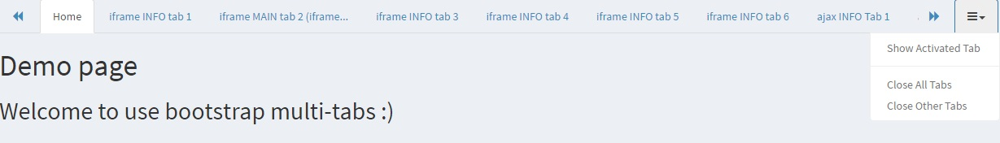
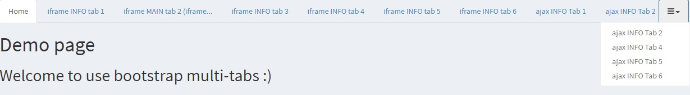
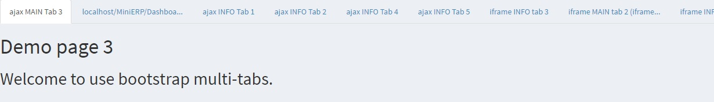

#bootstrap-multitabs / bootstrap 多标签页

##效果图
###default/默认 (带有向左、向右移动以及选项菜单)

###classic/折叠 (折叠隐藏tab)

###simple


##作用与优势
1. 通过简单的配置，生成可智能适配ajax和iframe的多标签页。
2. 可以直接套用bootstrap的各种模板样式。
3. 可避免误刷新造成的当前标签页丢失。也可以直接将链接发送给朋友。（如果设置了需要登录，请先登录后再进行此类操作）
4. 当标签数量设置为 1 的时候，隐藏便签列表

##安装需求
1. [Bootstrap 3.x](http://getbootstrap.com/)
2. 最新 [JQuery](http://jquery.com/)

##使用
1. 在html的head内引用multitabs的CSS
```html
<!-- Multi Tabs -->
<link rel="stylesheet" href="plugins/bootstrap-multitabs/css/style.css">
```

2. 在body底部引用multitabs的JS
```html
<!-- Multi Tabs -->
<script src="plugins/bootstrap-multitabs/js/multitabs.js"></script>
```

3. 并绑定multitabs的区域
```html
<script>
    $('.content-wrapper').multitabs();
</script>
```

4. 最后在需要关联链接中加入"multi-tabs"的class
```html
<a class="multi-tabs" href="pages/index-ajax-2.html">ajax INFO Tab 2</a>
```

** 至此，最简单的bootstrap-multitabs配置成功！**


##进阶配置

###链接可添加参数
1. ```[data-content="info"]``` 指定为content为info，共有3种( main | editor | info ), info 为缺省配置，可以不用指定，标签数量可以指定，当为1时，整个标签栏隐藏。main和editor分别只能有1个标签。
2. ```[data-iframe="true"]``` 指定为iframe模式，当值为false的时候，为智能模式，自动判断（内网用ajax，外网用iframe）。缺省为false。
3. ```[data-title="new tab"]``` 设置后指定标签页的标题，默认读取链接字体。
4. ```[data-url="index.html"]``` 如果对象不是<a>链接，此值可以指定链接URL

###初始化配置
下面这些为默认配置，可以自行修改
```html
<script>
    $('.content-wrapper').multitabs({
        showHash : true,                            //当值为true时，显示URL的hash，避免误按F5或者刷新的页面丢失，不过需要注意URL栏参数的泄露。
        showClose : false,                          //当值为false，仅在鼠标悬浮时显示关闭按钮。true时一直显示
        fixed : true ,                              //固定标签头列表
        layout : 'default',                         //有两种模式，'default', 'classic'(所有隐藏tab都在下拉菜单里) 和 'simple'
        type : 'nav-tabs',                          //可以为nav-tabs 或 nav-pills
        link : '.multi-tabs',                       //触发multitabs的selector text，注意需要有".","#"等
        iframe : false,                             //iframe模式的总局设置。当值为false的时候，为智能模式，自动判断（内网用ajax，外网用iframe）。缺省为false。
        class : '',                                 //主框架的class
        content : 'info',                           //此处可以指定标签页类型名称，一般不需要修改。
        init : [                                    //需要在初始加载的tab
            {                                       
                content :'',                        //标签页的类型，有 main | info | editor
                title : '',                         //标题（可选），没有则显示网址
                url : ''                            //链接，如为外链，强制为info页
            }, 
            {    ......    },                       //依次添加需要的页面
            {    ......    },
        ],       
        navBar : {
            class : '',                             //为navBar添加class
            maxTabs : 8,                            //最多tab数量。（main和editor不计算在内)
            maxTabTitleLength : 25,                 //tab标题的最大长度
            backgroundColor : '#f5f5f5',            //默认nav-bar 背景颜色
        },
        ajaxTabPane : {
            class : '',                             //为ajax tab-pane 添加class
        },
        iframeTabPane : {
            class : '',                             //为iframe tab-pane 添加class
            otherHeight : 0                         //其他高度，iframe需要剔除的高度，如footer
        },
        language : {                                //语言配置
            navBar : {
                title : 'Tab',                                  //默认的标签页名称
                dropdown : '<i class="fa fa-bars"></i>',                              //标签栏的下拉菜单名称
                showActivedTab : 'Show Activated Tab',          //下拉菜单的显示激活页面
                closeAllTabs : 'Close All Tabs',                //下拉菜单的关闭所有页面
                closeOtherTabs : 'Close Other Tabs',            //下拉菜单的关闭其他页面
            },
            editorUnsave: {
                colse : 'Your data is not save, are you sure to lose it?',   //关闭未保存editor标签页的警示
                cover : 'Can not cover Editor without saving the old one!'   //覆盖未保存editor标签页的警示
            }
        }
    });
</script>
```

##注意事项
为了自适应iframe高度，请依照下面这个样式添加CSS。

其中 ```.content-wrapper``` 是当前使用multitabs的wrapper。 ```.wrapper``` 为 ```.content-wrapper``` 的父层，需要将所有父层都添加 ```height: 100%```
```html
    <style type="text/css">
        body,
        body.full-height-layout .wrapper,
        html{
            height: 100%;
        }
        body.full-height-layout .content-wrapper{           //使用multitabs的wrapper
            height: calc(100% - 140px)                      //减去网页header和footer的高度，AdminLTE的为140px
        }
    </style>
```

## editor标签页
editor标签页默认只有一个.

editor标签页```.tab-tape ```内有 ``` .unsave ``` class的时：
1. 禁止覆盖。
2. 关闭确认提示
3. 关闭整个窗口提醒。