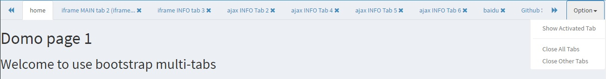

#bootstrap-multitabs

##Screenshot


##Role and Benefits
1. Zero configuration.
2. Auto ajax / iframe
3. Can use the templates of bootstrap
4. While ``` showHash : true; //default ``` show hash in url. 
5. While ``` maxTabs : 1 ``` or small screen, hide the tab header.

##Requirements
1. [Bootstrap 3.x](http://getbootstrap.com/)
2. Newest [JQuery](http://jquery.com/)

##Use
1. Add multitabs's CSS in the head
```html
<!-- Multi Tabs -->
<link rel="stylesheet" href="plugins/bootstrap-multitabs/css/style.css">
```

2. Add multitabs's JS in the bottom ot body
```html
<!-- Multi Tabs -->
<script src="plugins/bootstrap-multitabs/js/multitabs.js"></script>
```

3. Bind the content wrapper
```html
<script>
    $('.content-wrapper').multitabs();
</script>
```

4. At last, add "multi-tabs" class in the link which you want.
```html
<a class="multi-tabs" href="pages/index-ajax-2.html">ajax INFO Tab 2</a>
```

** Now, the simple bootstrap-multitabs works!**


##Advanced setting

###Parameter of link
1. ```[data-content="info"]``` content type, can be (main | editor | info), info is the default and the normal one. Main and editor just can be 1 tab.
2. ```[data-iframe="true"]``` iframe mode, default is false. While false, is the auto mode (for the self page, use ajax, and the external, use iframe)
3. ```[data-title="new tab"]``` tab's tittle, if empty or undefined, tab's tittle will be link's text.
4. ```[data-url="index.html"]``` this parameter for the object not link.

###Initial Configuration
The following is the default configuration, you can modify as you want.
```html
<script>
    $('.content-wrapper').multitabs({
        showHash : true,                            //当值为true时，显示URL的hash，避免误按F5或者刷新的页面丢失，不过需要注意URL栏参数的泄露。
        fixed : true ,                              //固定标签头列表
        content : 'info',                           //此处可以指定标签页类型名称，一般不需要修改。
        link : '.multi-tabs',                       //触发multitabs的selector text，注意需要有".","#"等
        iframe : false,                             //iframe模式的总局设置。当值为false的时候，为智能模式，自动判断（内网用ajax，外网用iframe）。缺省为false。
        class : '',                                 //主框架的class
        backgroundColor : '#fff',                   //默认为白色背景
        init : [
            {                                       //需要在初始加载的tab
                content :'',                        //标签页的类型，有 main | info | editor
                title : '',                         //标题（可选），没有则显示网址
                url : ''                            //链接，如为外链，强制为info页
            }, 
            {    ......    },                       //依次添加需要的页面
            {    ......    },
        ],       
        tabHeader : {
            class : '',                             //为tabHeader添加class
            maxTabs : 8,                            //最多tab数量。（main和editor不计算在内)
            maxTabTitleLength : 25,                 //tab标题的最大长度
        },
        ajaxTabPane : {
            class : '',                             //为ajax tab-pane 添加class
        },
        iframeTabPane : {
            class : '',                             //为iframe tab-pane 添加class
            otherHeight : 0                         //其他高度，iframe需要剔除的高度，如footer
        },
        language : {                                //语言配置
            tabHeader : {
                title : 'Tab',                                  //默认的标签页名称
                option : 'Option',                              //标签栏的下拉菜单名称
                showActivedTab : 'Show Activated Tab',          //下拉菜单的显示激活页面
                closeAllTabs : 'Close All Tabs',                //下拉菜单的关闭所有页面
                closeOtherTabs : 'Close Other Tabs',            //下拉菜单的关闭其他页面
            },
            editorUnsave: {
                colse : 'Your data is not save, are you sure to lose it?',   //关闭未保存editor标签页的警示
                cover : 'Can not cover Editor without saving the old one!'   //覆盖未保存editor标签页的警示
            }
        }
    });
</script>
```

##注意事项
为了自适应iframe高度，请依照下面这个样式添加CSS。

其中 ```.content-wrapper``` 是当前使用multitabs的wrapper。 ```.wrapper``` 为 ```.content-wrapper``` 的父层，需要将所有父层都添加 ```height: 100%```
```html
    <style type="text/css">
        body,
        body.full-height-layout .wrapper,
        html{
            height: 100%;
        }
        body.full-height-layout .content-wrapper{           //使用multitabs的wrapper
            height: calc(100% - 140px)                      //减去网页header和footer的高度，AdminLTE的为140px
        }
    </style>
```

## editor标签页
editor标签页默认只有一个.

editor标签页```.tab-tape ```内有 ``` .unsave ``` class的时：
1. 禁止覆盖。
2. 关闭确认提示
3. 关闭整个窗口提醒。